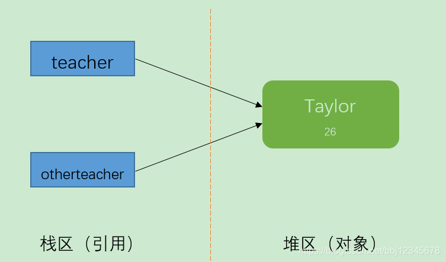
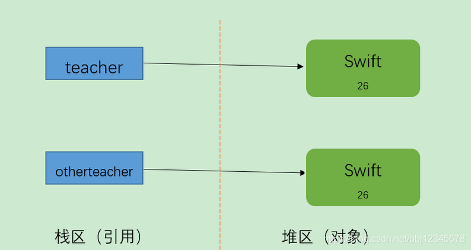
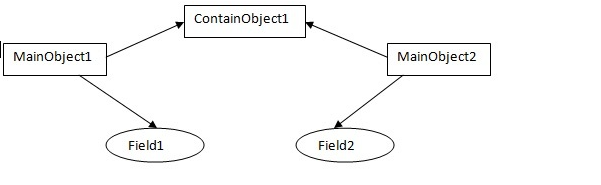
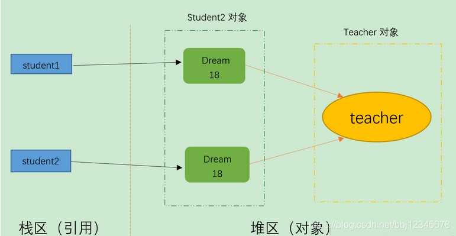
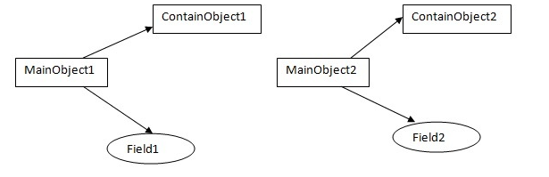
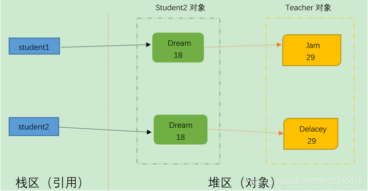

#### 拷贝分类
##### 引用拷贝
* 创建一个指向对象的引用变量的拷贝。

##### 对象拷贝
* 创建对象本身的一个副本。

##### 浅拷贝
* 对基本数据类型进行值传递，对引用数据类型进行引用传递般的拷贝

```java
实现 Cloneable 接口，并且重写 clone() 方法

@Override
public Object clone(){
try {
    //浅拷贝
    return super.clone();
        } catch (CloneNotSupportedException e) {
        }
        return null;
    }
```
* 浅拷贝仅仅复制所考虑的对象，而不复制它所引用的对象。

##### 深拷贝
* 对基本数据类型进行值传递，对引用数据类型，创建一个新的对象，并复制其内容，此为深拷贝。

###### 深拷贝实现
* 序列化（serialization）这个对象，再反序列化回来，就可以得到这个新的对象
* 继续利用 clone() 方法，既然 clone() 方法，是我们来重写的，实际上我们可以对其内的引用类型的变量，再进行一次 clone()。
```java
    @Override
    public Object clone(){
        try {
            深拷贝
            Student cloneStudent = (Student) super.clone();
            cloneStudent.child = (ChildClass) this.child.clone();
            return cloneStudent;

        } catch (CloneNotSupportedException e) {
        }
        return null;
    }
```
* 深拷贝把要复制的对象所引用的对象都复制了一遍。
