### TCP/IP网络模型
#### 应用层
* 当连个设备需要通信的时候，应用层把应用数据传输给下一层(传输层)。
* 应用层只专注于为用户提供功能，不用关心数据如何传输。
#### 传输层
* 传输层为应用层提供网络支持
  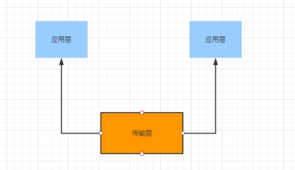
* 传输层有两大协议TCP和UDP
    * 当传输数据非常大，数据包大小超过MSS(TCP最大报文长度)，就会将数据分块即使文件损坏或丢失，只需要重新分配；在TCP协议中，把每个块称为一个TCP段(TCP Segment)
  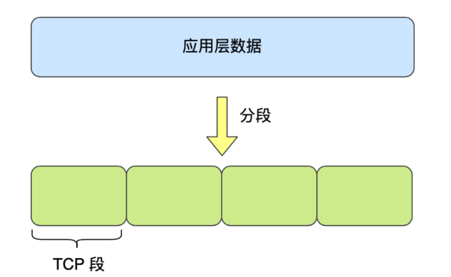
* 当设备作为接收方，一个设备有多个应用在接受或者传输数据，需要用端口来区分应用;传输层的报文会携带端口号，接收发可以识别报文是发送给哪个应用。
#### 网络层
* 传输层协议处理太多的事情，只需要服务好应⽤即可，让其作为应⽤间数据传输的媒介，帮助实现应⽤到应⽤的通信，⽽实际的传输功能就交给下⼀层，也就是⽹络层（Internet Layer）。
  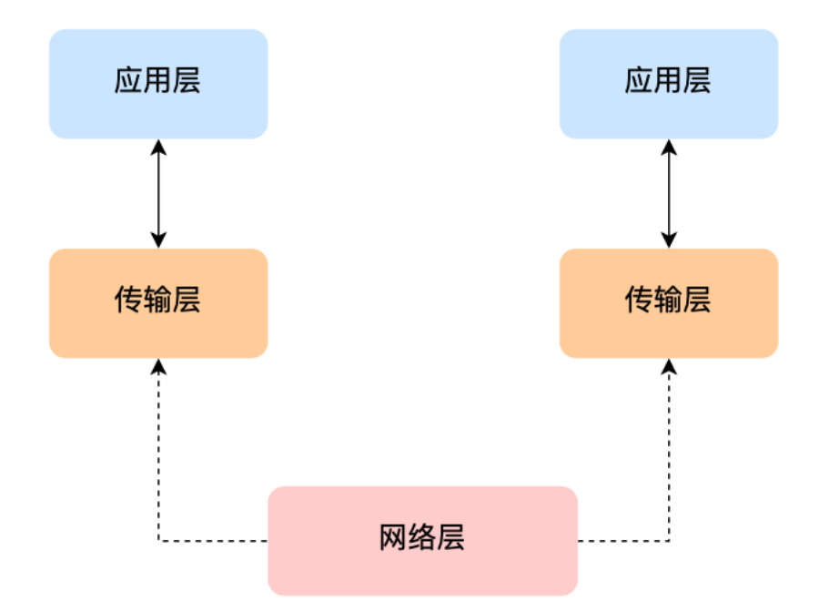
* 网络层常用的是IP协议，IP 协议会将传输层的报⽂作为数据部分，再加上IP包头组装成IP报⽂，如果IP报⽂⼤⼩超过MTU（以太⽹中⼀般为 1500 字节）就会再次进⾏分⽚，得到⼀个即将发送到⽹络的IP报⽂
  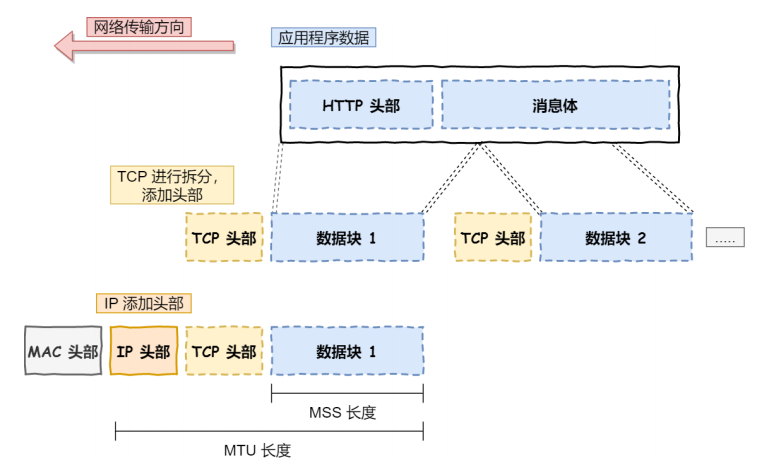
* ⽹络层负责将数据从⼀个设备传输到另⼀个设备，网络层需要有区分设备的编号。
* ⼀般⽤IP地址给设备进⾏编号，对于IPv4协议，IP地址共32位，分成了四段，每段是8位。
* IP地址被分为两种：
    * ⼀个是⽹络号，负责标识该IP是属于哪个子网的；
    * 一个是主机号，负责标识同一网下的不同主机；
* 结合子网掩码才能算出IP地址的网络号和主机号。那么在寻址的过程中，先匹配到相同的⽹络号，才会去找对应的主机。
* IP协议还有另⼀个重要的能⼒就是路由。实际场景中，两台设备并不是⽤⼀条⽹线连接起来的， ⽽是通过很多⽹关、路由器、交换机等众多⽹络设备连接起来的，那么就会形成很多条⽹络的路径，因此当数据包到达⼀个⽹络节点，就需要通过算法决定下⼀步⾛哪条路径。
* **注：** IP协议的寻址作⽤是告诉我们去往下⼀个⽬的地该朝哪个⽅向⾛，路由则是根据「下⼀个⽬的地」选择路径。寻址更像在导航，路由更像在操作⽅向盘。
#### 数据链路层
* 传输数据需要跨网络进行传输，路由器作为中间设备，路由器可以通过路由表计算出下一个要去的IP，但路由无法确定哪一个设备。
* 需要有⼀个专⻔的层来标识⽹络中的设备，让数据在⼀个链路中传输，这就是数据链路层（Data LinkLayer），它主要为⽹络层提供链路级别传输的服务。
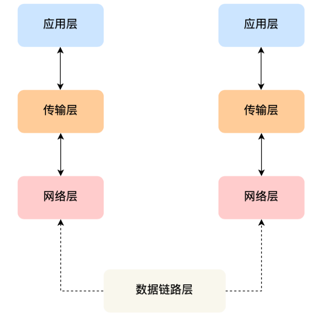
* 每一台设备的网卡都会有一个MAC地址，它是用来唯一标识设备的。路由器计算出了下⼀个⽬的地IP地址，再通过ARP协议(将IP地址解析成MAC地址)找到该⽬的地的MAC地址。
#### 物理层
* 当数据准备要从设备发送到⽹络时，需要把数据包转换成电信号，让其可以在物理介质中传输，这⼀层就是物理层 （Physical Layer），它主要是为数据链路层提供⼆进制传输的服务。
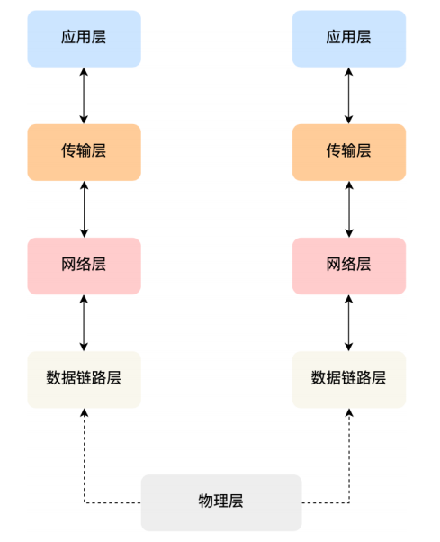
### HTTP
#### HTTP基本概念
* HTTP 是⼀个在计算机世界⾥专⻔在「两点」之间「传输」⽂字、图⽚、⾳频、视频等「超⽂本」数据的「约定和规范」
#### HTTP常用字段
* Host：客户端发送请求时，用来指定服务器的域名。
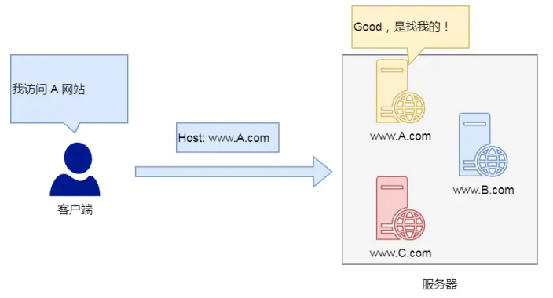
* Content-Length:服务器在返回数据时，会有 Content-Length 字段，表明本次回应的数据⻓度；如上⾯则是告诉浏览器，本次服务器回应的数据⻓度是1000个字节，后⾯的字节就属于下⼀个回应了。
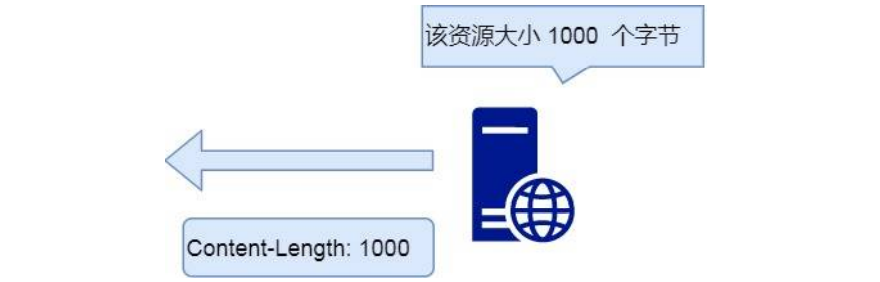
* Connection：常用于客户端要求服务器使用TCP持久连接，以便其他请求复用。
    * HTTP/1.1 版本的默认连接都是持久连接，但为了兼容⽼版本的 HTTP，需要指定 Connection ⾸部字段的值为 Keep-Alive 
    * Connection: keep-alive
    * ⼀个可以复⽤的TCP连接就建⽴了，直到客户端或服务器主动关闭连接。但是，这不是标准字段
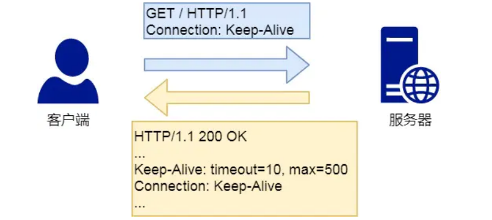
* Content-Type：用于服务器回应时，告诉客户端本次数据格式。
    * Content-Type: text/html; charset=utf-8 -> 发送的是网页，而且编码是UTF-8
    * 客户端请求的时候，可以使⽤ Accept 字段声明⾃⼰可以接受哪些数据格式。 Accept: */* ->客户端声明自己可以接受任意格式。
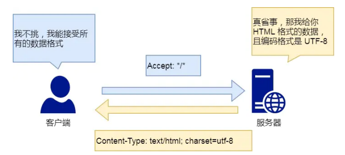
* Content-Encoding：说明字段的压缩方法
    * Content-Encoding: gzip  -> 表示服务器返回的数据采⽤了 gzip ⽅式压缩，告知客户端需要⽤此⽅式解压
    * Accept-Encoding：客户端说明自己可接受的压缩方法。Accept-Encoding：gzip,deflate
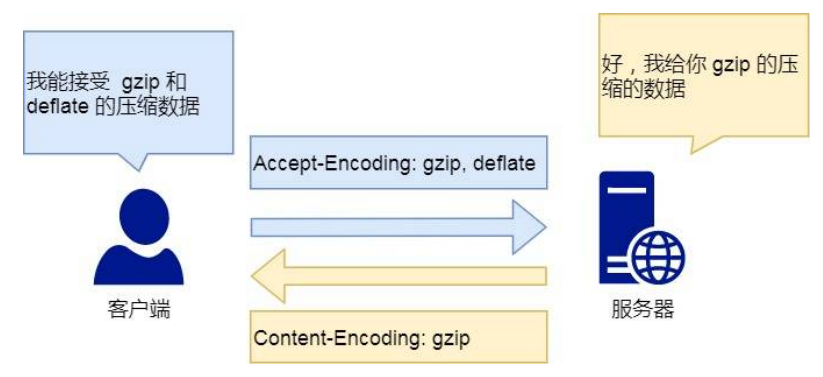